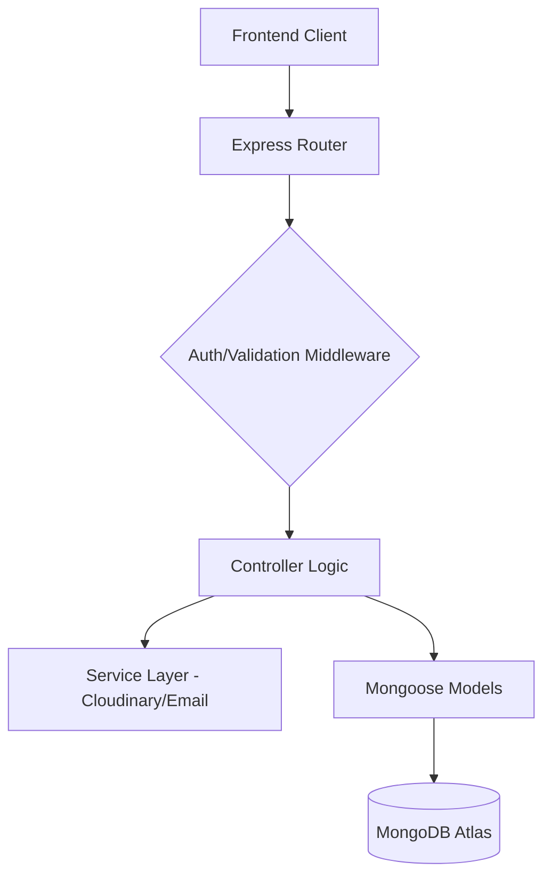

# 🎵 WebMusicVault API - Engineering Documentation

Welcome to the core of **WebMusicVault**. This backend is a high-performance, scalable Node.js application designed to manage a complete music streaming ecosystem with a focus on security, speed, and clean architecture.

---

## 📑 Table of Contents
- [Architecture Overview](#-architecture-overview)
- [Tech Stack](#-tech-stack)
- [System Features](#-system-features)
- [Database Schema](#-database-schema)
- [Security & Authentication](#-security--authentication)
- [API Documentation](#-api-documentation)
- [Environment Configuration](#-environment-configuration)
- [Installation & Setup](#-installation--setup)

---

## 🏗 Architecture Overview

The system follows a strict **Controller-Service-Model** pattern, ensuring that business logic is decoupled from transport and storage layers.



- **Routes**: Define the entry points and connect them to middleware and controllers.
- **Controllers**: Handle the HTTP request/response cycle and coordinate services.
- **Middleware**: Intercepts requests for JWT validation, file parsing (Multer), and Zod schema validation.
- **Services**: Abstract external integrations (Cloudinary for media, Resend/Nodemailer for communication).

---

## 🛠 Tech Stack

- **Runtime**: [Node.js](https://nodejs.org/) (LTS)
- **Framework**: [Express.js](https://expressjs.com/) - Fast, unopinionated web framework.
- **Language**: [TypeScript](https://www.typescriptlang.org/) - Ensuring type-safety across the API.
- **Database**: [MongoDB](https://www.mongodb.com/) with [Mongoose](https://mongoosejs.com/) ODM.
- **Security**: 
  - `jsonwebtoken` for stateless authentication.
  - `bcryptjs` for salted password hashing.
  - `cookie-parser` for secure token storage.
- **Validation**: [Zod](https://zod.dev/) - First-class schema validation for environment and requests.
- **Media**: [Cloudinary SDK](https://cloudinary.com/documentation/node_integration) - Cloud-native audio/image management.

---

## 🚀 System Features

### 1. Robust Authentication
- **Double Token Strategy**: Uses short-lived Access Tokens and long-lived Refresh Tokens (HTTP-only cookies).
- **Social Login**: Full Google OAuth 2.0 integration for frictionless onboarding.
- **OTP Verification**: Crypto-secure 6-digit codes for email verification and password recovery.

### 2. High-Performance Music Handling
- **Sequential Streaming**: Optimized for Cloudinary delivery with direct URL generation.
- **Upload Queueing**: Backend logic specifically designed to handle sequential file uploads to prevent server bottlenecks.
- **Metadata Management**: Stores durations, covers, and artist info for instant frontend loading.

### 3. Advanced Search & Pagination
- **Regex Search**: Fast, case-insensitive searching across songs and artists.
- **Cursor-Based Pagination**: Optimized for infinite scroll on the frontend, ensuring high performance even with thousands of tracks.

---

## 📊 Database Schema

### **User Model**
| Field | Type | Description |
| :--- | :--- | :--- |
| `username` | String | Unique identifier (required) |
| `email` | String | Unique, verified email (required) |
| `password` | String | Hashed using Bcrypt (optional for OAuth) |
| `avatar` | String | Cloudinary URL for profile image |
| `isEmailVerified`| Boolean | Verification status |

### **Song Model**
| Field | Type | Description |
| :--- | :--- | :--- |
| `title` | String | Title of the track |
| `artist` | String | Name of the artist/creator |
| `audioUrl` | String | Primary Cloudinary stream link |
| `coverImage` | String | Thumbnail image link |
| `uploadedBy` | ObjectId | Reference to the User model |

---

## 📡 API Documentation

### 🔐 Authentication
| Method | Endpoint | Description |
| :--- | :--- | :--- |
| `POST` | `/api/auth/signup` | Register a new user |
| `POST` | `/api/auth/login` | Authenticate & receive tokens |
| `POST` | `/api/auth/google` | Social login via Google |
| `POST` | `/api/auth/logout` | Clear secure cookies |
| `POST` | `/api/auth/refresh` | Rotate Access Token |

### 🎵 Songs & Playlists
| Method | Endpoint | Description |
| :--- | :--- | :--- |
| `GET` | `/api/songs` | Fetch all songs (paginated) |
| `POST` | `/api/songs/upload` | Securely upload audio & cover |
| `GET` | `/api/songs/search` | Dynamic search query handler |
| `POST` | `/api/playlists` | Create a custom music vault |
| `PUT` | `/api/songs/like/:id` | Toggle like status for a track |

---

## ⚙️ Environment Configuration

Copy `.env.example` to `.env` and fill in the following:

### **Required Credentials**
- **MongoDB**: `MONGODB_URI` (Atlas connection string)
- **Cloudinary**: `CLOUD_NAME`, `API_KEY`, `API_SECRET`
- **Google Cloud**: `CLIENT_ID`, `CLIENT_SECRET`
- **Email**: `GMAIL_USER`, `GMAIL_APP_PASSWORD` (Use App Passwords for 2FA accounts)

### **Internal Settings**
- `ACCESS_TOKEN_SECRET`: A long random string for JWT signing.
- `MAX_MUSIC_FILE_SIZE`: Default is `26214400` (25MB).

---

## 🛠 Installation & Setup

1. **Install Node.js & Dependencies**:
   ```bash
   npm install
   ```

2. **Database Initialization**:
   Ensure your MongoDB Atlas cluster is running and your IP is whitelisted.

3. **Development Mode**:
   Starts the server with `nodemon` for hot-reloading.
   ```bash
   npm run dev
   ```

4. **Production Build**:
   Compiles TypeScript to optimized JavaScript.
   ```bash
   npm run build
   npm start
   ```

---
*Developed by the Aaditya0222.*
